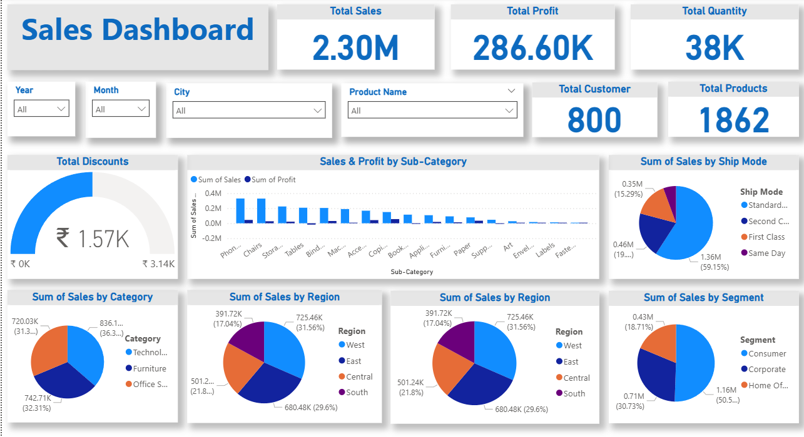

# Power BI Sales Insights Dashboard

This repository contains a Power BI dashboard built using a sales dataset with 10,018 records.

## 🔍 Features
- Sales overview by region, category, sub-category
- Time-based insights (Order Date, Ship Date)
- Customer segmentation
- Interactive filters and slicers

## 📁 Files
- `SalesInsightsDashboard.pbix` – Main Power BI file
- `sales_data.csv` – Source dataset
- `screenshot1.png`, `screenshot2.png` – Preview of dashboard

## 📷 Preview

## 🚀 How to Use
1. Clone or download this repository
2. Open the `.pbix` file in Power BI Desktop
3. Explore the visuals and insights

## 📌 Dataset Columns
- RowID, OrderID, OrderDate, ShipDate, ShipMode
- CustomerID, Segment, Country/Region, City
- State/Province, Region, ProductID, Category, Sub-Category, Product Name

